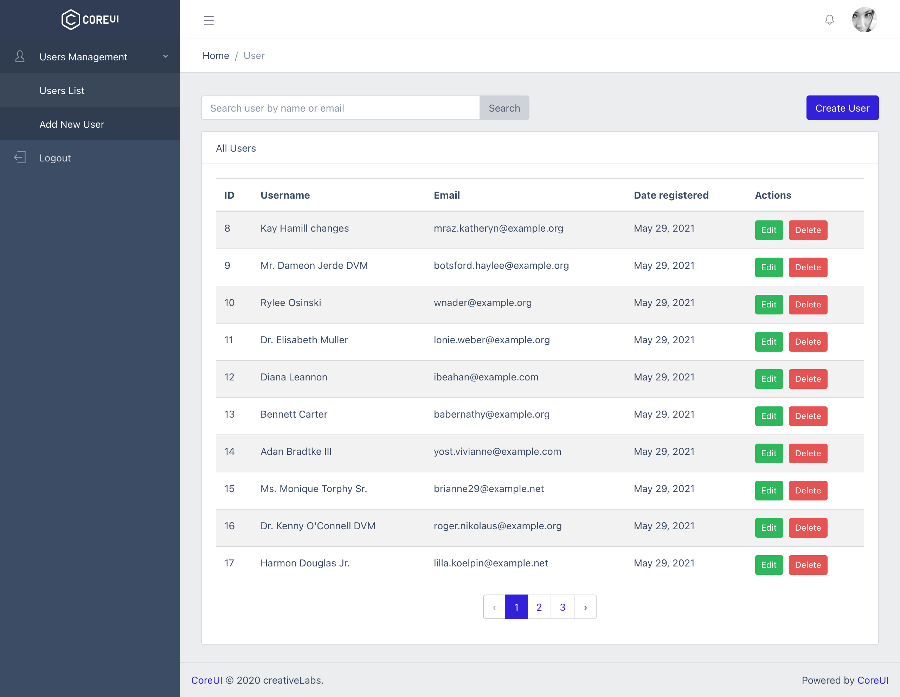

# Laravel Core UI Boilerplate



## Installation

Clone the repo locally:

```sh
git clone
```

Install PHP dependencies:

```sh
composer install
```

Install NPM dependencies:

```sh
npm install
```

Build assets:

```sh
npm run dev
```

Setup configuration:

```sh
cp .env.example .env
```

Generate application key:

```sh
php artisan key:generate
```

Create an SQLite database. You can also use another database (MySQL, Postgres), simply update your configuration accordingly.

```sh
touch database/database.sqlite
```

Run database migrations:

```sh
php artisan migrate
```

Run database seeder:

```sh
php artisan db:seed
```

Run the dev server (the output will give the address):

```sh
php artisan serve
```

## Running tests

To run the Ping CRM tests, run:

```
phpunit
```
